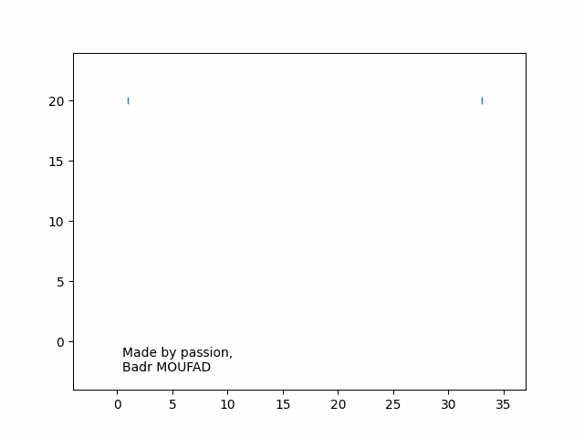

<!-- Animation of my name-->

    

> *Built with pure numpy and matplotlib*.
> [Wanna make your own?](https://github.com/Badr-MOUFAD/animate_your_name)

<!-- content -->

# Hello and Welcome!  

I’m Badr MOUFAD, an engineering student with a major in **industrial management engineering** and a minor in **data science**. I am an intern at **INRIA Lyon**, team **DANTE**. I work on the design and implementation of fast solvers for non-convex inverse sparse problems. I am currently focusing on the development of [Celer](https://github.com/mathurinm/celer.git) – A fast solver for L1-type problems.

As an auto learner, I constantly seek to sharpen my existing knowledge and gain new skills. I am passionate about computational mathematics, extremely fascinated by coding, and I really enjoy solving algorithmic problems. Also, I enjoy building Web/Desktop Apps, from time to time. 

# Tools and Technologies

My Dev Stack for computational mathematics, data science, Web/Desktop apps, and robotics.

 
  

 
 
   
 
 
 

 

# Explore my projects

I like to share my thoughts. So far, I have written two articles. The first one is about the [inverse sampling method](https://towardsdatascience.com/an-insight-on-generating-samples-from-a-custom-probability-density-function-d0a06c290c54) whereas the other on [structering data science project](https://towardsdatascience.com/its-time-to-structure-your-data-science-project-1fa064fbe46). The best is yet to come...

To learn more about the projects I have worked on, take a while to explore **my repositories** by following [this link](https://github.com/Badr-MOUFAD?tab=repositories), or browse further **below**.
